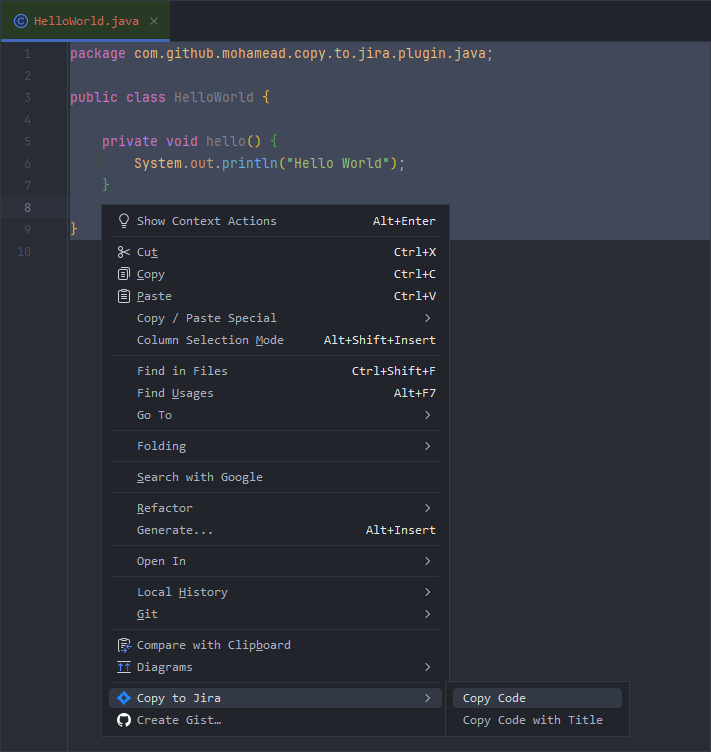
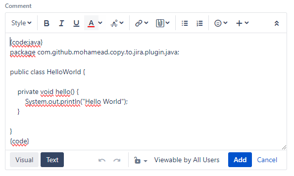
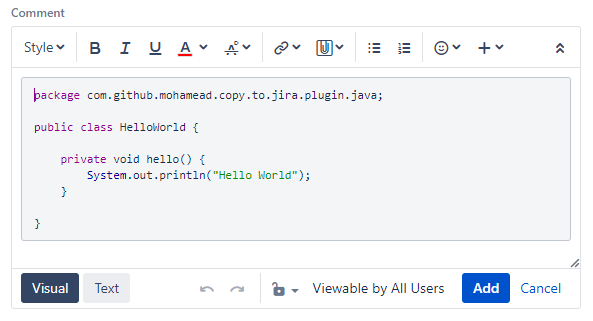

# Copy 2 Jira

<!-- Plugin description -->
Simple plugin that lets you copy code from the IDE directly to a jira task(s), without using jira code formatter. 
<!-- Plugin description end -->

## Installation

- Using the IDE built-in plugin system:
  
  <kbd>Settings/Preferences</kbd> > <kbd>Plugins</kbd> > <kbd>Marketplace</kbd> > <kbd>Search for "Copy 2 Jira"</kbd> >
  <kbd>Install</kbd>
  
- Using JetBrains Marketplace:

  Go to [JetBrains Marketplace](https://plugins.jetbrains.com/plugin/MARKETPLACE_ID) and install it by clicking the <kbd>Install to ...</kbd> button in case your IDE is running.

  You can also download the [latest release](https://plugins.jetbrains.com/plugin/MARKETPLACE_ID/versions) from JetBrains Marketplace and install it manually using
  <kbd>Settings/Preferences</kbd> > <kbd>Plugins</kbd> > <kbd>⚙️</kbd> > <kbd>Install plugin from disk...</kbd>

- Manually:

  Download the [latest release](https://github.com/mohamead/copy-2-jira-plugin/releases/latest) and install it manually using
  <kbd>Settings/Preferences</kbd> > <kbd>Plugins</kbd> > <kbd>⚙️</kbd> > <kbd>Install plugin from disk...</kbd>

## Usage
In order to use the plugin select a piece of code, right click (or use the context menu button) and select <kbd>Copy 2 jira</kbd> > <kbd>Copy Code</kbd> or <kbd>Copy Code with Title</kbd>

In a jira task, e.g. under comment, select `Text` and past inn code.

Select `Visual` to see the format. 

**NB!** The plugin supports the following programming languages: `ActionScript`, `Ada`, `AppleScript`, `bash`, `C`, `C#`, `C++`, `CSS`, `Erlang`, `Go`, `Groovy`, `Haskell`, `HTML`, `Java`, `JavaScript`, `JSON`, `Lua`, `Nyan`, `Objc`, `Perl`, `PHP`, `Python`, `R`, `Ruby`, `Scala`, `SQL`, `Swift`, `VisualBasic`, `XML` and `YAML`

## Contributing
Pull requests are welcome. For major changes, please open an issue first to discuss what you would like to change.

Please make sure to update tests as appropriate.

## License
[apache-2.0](https://choosealicense.com/licenses/apache-2.0/)

---
Plugin based on the [IntelliJ Platform Plugin Template][template].

[template]: https://github.com/JetBrains/intellij-platform-plugin-template
[docs:plugin-description]: https://plugins.jetbrains.com/docs/intellij/plugin-user-experience.html#plugin-description-and-presentation
